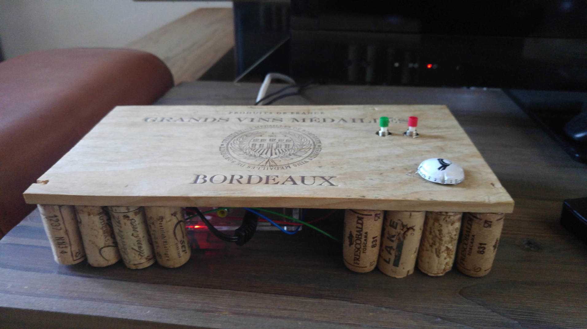

# Web Radio for Rasberry PI

Build your Web radio for streaming on Resberry Pi (Bannan PI) in simple step by step manual. 
 
## Description

Building your own radio is fun than buying one. Using Raberry PI (Banana PI) can be interesting  for kids to understand basic of hardware and software. 

## Hardware setup

The result may look like these pictures, but feel free to use  your creativity





### Materials
- You need two push button, like for example  or 
- Jumper wires with connectors for the Rasberry PI 
- Wooden board for the front. It must be nice one, lile using wine wooden box
- Corks for side decoration
- Rasberry PI, OS on SD Card, HDMI, power and LAN cable  

### Steps

- Make two holes on the board
- Set up the push buttons
- Wire (solder) the two busch buttons to GPIO 23 and 24 and Ground 

- Glue the corks onside but leave place for the cables
- Glue the Rasberry PI (Banana PI) 
- Wire with HDMI, Ethernet and Power

## Software setup 

I have used Bananna PI with Ubuntu Server, but it will work in the same way in all Rasberry PIs. Depending on the OS you may have slight differences

- OS set up on the SD card  *stap dow are for Ubuntu*  
- **Install**  (MPD) and alsa-utils  
```
sudo apt-get install mpc mpd alsa-utils
```
- **Create your Playlist** or use example in *./sources/radio.m3u*
- **Playlist install** Copy the playlist file in  */var/lib/mpd/playlists/radio.m3u* on your Rasberry
- **HDMI Output** If you want to use HDMI audio output, then copy file *./sources/asound.conf* to */etc/asound.conf*.Otherwise you will use the analog output. I recommend HDMI since provides better sound quality
- **Conrol programm** Copy *./sources/webradio_control.py* to */home/pi/webradio_control.py* on your RPI (Rasberry PI) 
- **Create Service** Copy *./sources/init-radio.service* to */etc/systemd/system/init-radio.service* on your PRI  
- **Init the service** to start on boot with `service init-radio enable`. You can manage it with  `service init-radio start|stop|status`

